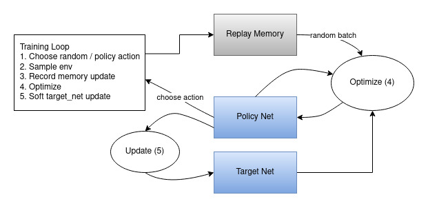

# Flappy Bird AI Agent (Dueling DQN)

This project implements an AI agent capable of playing **Flappy Bird** using **Dueling Deep Q-Learning (Dueling DQN)**. The network architecture is designed to separately estimate the value of a state and the advantage of each action.

## Project Overview

The agent interacts with the `flappy-bird-gymnasium` environment. It receives raw screen pixels as input, processes them through a Convolutional Neural Network (CNN), and outputs the best action (Flap or Do Nothing) to maximize the score.

## Network Architecture (Dueling DQN)

The architecture follows the **Dueling Deep Q-Network** pattern, which splits the network into two streams after the convolutional layers.



### 1. Input Processing
-   **Preprocessing**: Raw frames are resized to **84x84** pixels and converted to grayscale.
-   **Input Shape**: `(Batch_Size, 1, 84, 84)`.

### 2. Feature Extractor (CNN)
The image passes through convolutional layers to extract visual features (pipes, bird position):
1.  **Conv1**: 32 filters, kernel 8x8, stride 4 (ReLU).
2.  **MaxPool1**: Kernel 2x2, stride 1.
3.  **Conv2**: 64 filters, kernel 4x4, stride 2 (ReLU).
4.  **Conv3**: 64 filters, kernel 3x3, stride 1 (ReLU).

The output is flattened and passed through a common fully connected layer:
*   **FC1**: Linear(Input_Dim, 512) -> ReLU

### 3. Dueling Streams
Instead of outputting Q-values directly, the network splits into two separate streams:

1.  **Value Stream ($V(s)$)**: Estimates the scalar value of the current state $s$.
    *   `Linear(512, 1)`
2.  **Advantage Stream ($A(s, a)$)**: Estimates the advantage of taking action $a$ in state $s$.
    *   `Linear(512, n_actions)`

### 4. Aggregation Layer
The two streams are combined to produce the final Q-values using the aggregation formula (see Mathematical Foundation).

## Mathematical Foundation

### From Standard Q-Learning to Dueling Architecture

In standard Q-Learning, the Q-function $Q(s, a)$ measures the expected return of taking action $a$ in state $s$.
However, for many states, the value of the state itself is more important than the specific action taken (e.g., if the bird is about to crash, all actions are bad).

**Decomposition:**
We can decompose the Q-function into two parts:
1.  **Value Function $V(s)$**: How good it is to be in state $s$.
2.  **Advantage Function $A(s, a)$**: How much better action $a$ is compared to the "average" action in state $s$.

$$ Q(s, a) = V(s) + A(s, a) $$

**The Identifiability Problem:**
If we just sum them up, the equation is unidentifiable (we can add a constant to $V$ and subtract it from $A$ without changing $Q$). To solve this and force $V$ to represent the value of the state, we subtract the mean of the advantages.

**Final Aggregation Formula:**
The network outputs the final Q-values using this formula:

$$ Q(s, a) = V(s) + \left( A(s, a) - \frac{1}{|\mathcal{A}|} \sum_{a'} A(s, a') \right) $$

Where:
*   $|\mathcal{A}|$: Number of possible actions.

This forces the Advantage function to have zero mean, making the Q-values stable and identifiable.

## Training Algorithm

The agent uses **Deep Q-Learning** with **Experience Replay** and a **Target Network**.

### Parameter Update (Gradient Descent)
Instead of updating Q-values directly (as in tabular Q-Learning), we update the network weights $\theta$ to minimize the loss using Gradient Descent:

$$ \theta \leftarrow \theta - \eta \cdot \nabla_\theta Loss $$

Where:
*   $\eta$: Learning Rate (controls the step size of the update).
*   $\nabla_\theta Loss$: Gradient of the loss function with respect to the parameters.

### Loss Function (Deep Learning)
In the context of Deep Learning, we minimize the **Mean Squared Error (MSE)** between the predicted Q-value and the Bellman Target:

$$ Loss = \left( \underbrace{R + \gamma \max_{a'} Q(S', a')}_{\text{Target}} - \underbrace{Q(S, A)}_{\text{Prediction}} \right)^2 $$

*   **Target Network**: A copy of the policy network that is "softly" updated to stabilize training targets.
*   **Experience Replay**: Transitions (`state`, `action`, `reward`, `next_state`) are stored in a buffer and sampled randomly to break data correlation.

## Installation

1.  Instalează dependențele:
    ```bash
    pip install -r requirements.txt
    ```

## Usage

### Training
To train the agent from scratch:
```bash
python main.py
```

### Replay
To watch a trained agent play (requires `model.pth`):
```bash
python replay.py
```

